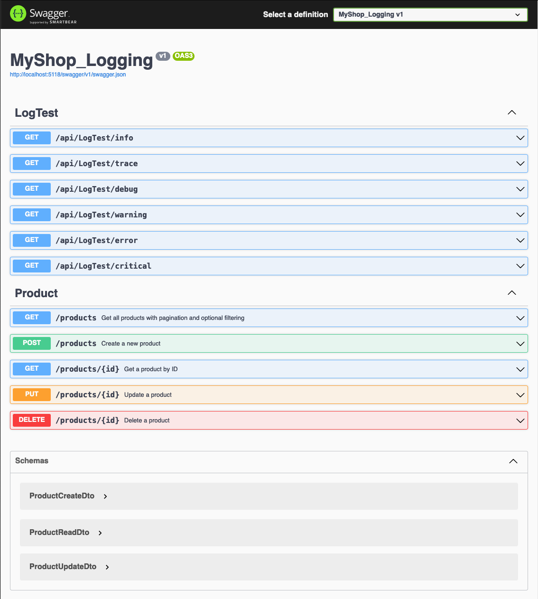

# MyShop_Logging
## A .NET WEB API project for learning logging and error handling

### Description
This project focuses on best practice code structure as well as handling errors in a conventional and efficient way. The project is a simple e-commerce website that allows users to view products, add them to a cart, and checkout. The project is built using ASP.NET Core 8 and uses Entity Framework Core for data access.

